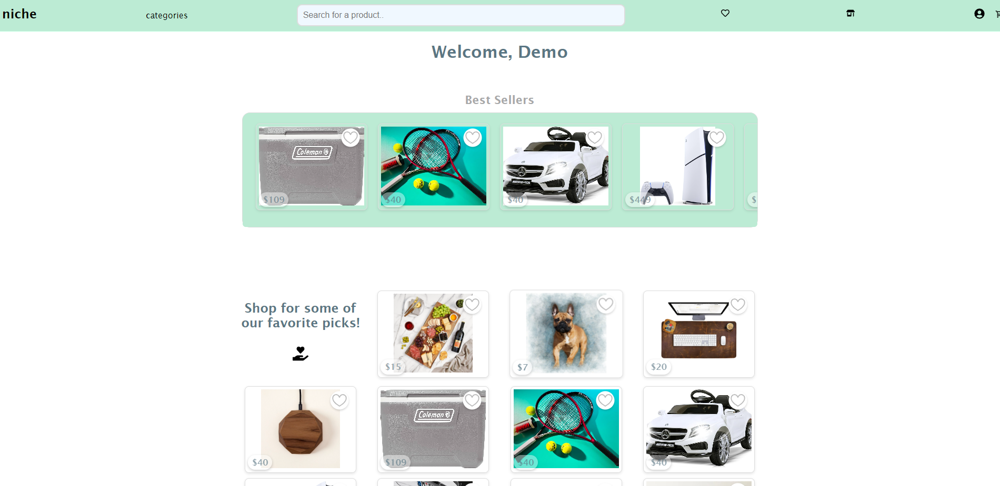
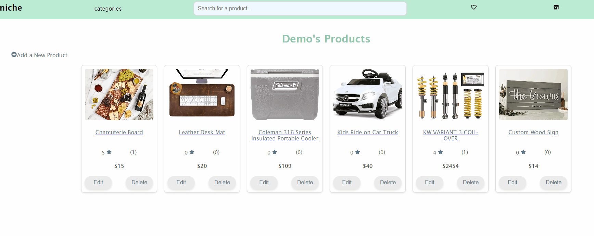
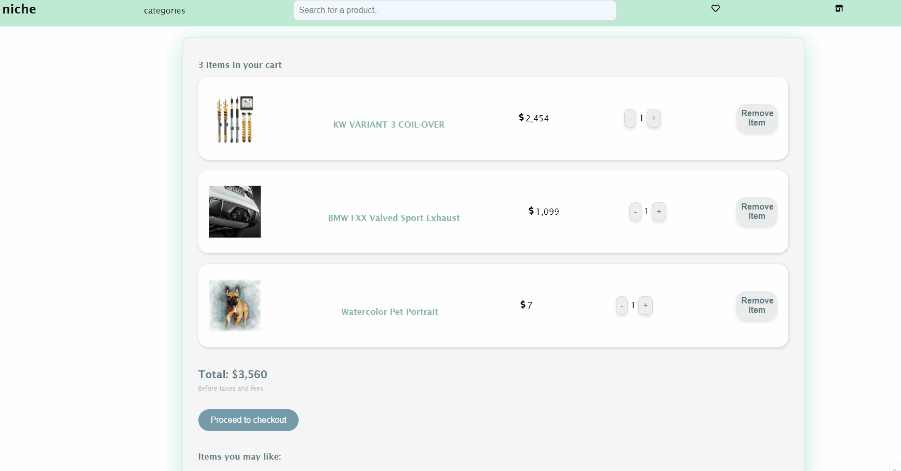
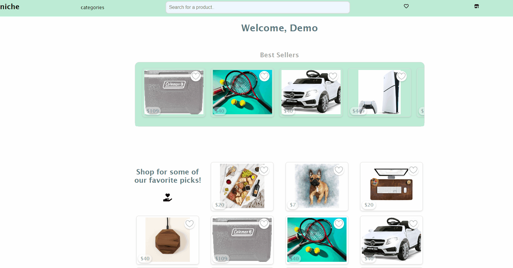

# <h1>niche </h1>


## Table of Contents
* [Introduction](#introduction)
* [Getting Started](#getting-started)

## Introduction
Welcome to [niche](https://niche-mfjc.onrender.com/), a group project built on Flask and React-Vite. This fictional web store is meant to provide users the ability to browse and favorite custom wares made by independent artists, designers and hobbyists!



### Favorite Demo


### Cart Demo


### Search Demo


## Getting started

1. Clone this repository.

2. Install dependencies.

   ```bash
   pipenv install -r requirements.txt
   ```

3. Create a __.env__ file based on the example with proper settings for your
   development environment.

4. Make sure the SQLite3 database connection URL is in the __.env__ file.

5. Get into your pipenv, migrate your database, seed your database, and run your
   Flask app:

   ```bash
   pipenv shell
   ```

   ```bash
   flask db upgrade
   ```

   ```bash
   flask seed all
   ```

   ```bash
   flask run
   ```

6. To run the React frontend in development, `cd` into the __react-vite__ directory and run `npm i` to install dependencies. The Dockerfile has a `--watch` flag attached to the `dist` build, and will containerize the entire application, making it easier to set up and deploy. Then, run `npm run dev` to view a local version of the project on your browser.
